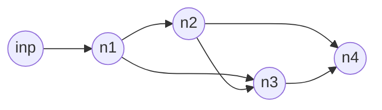

# `pipelines` -- Create Async Processing Pipelines Quick!
[](https://www.python.org/downloads/release/python-370/)


## What is it ?
`pipelines` is a library for webapp developers to help them create async processing pipelines quickly and effortlessly. The motivation being - 
> *"The dev should only be worried about defining coroutines that **DO** the actual processing"*

## How does it work ?
> *The central idea behind `pipelines` is -* ***a series of producer-consumer relationships between connected nodes***


A processing ***pipeline*** is represented as a *directed graph* of nodes where each node represents a *processor*. Each processor has associated with it a coroutine that performs some arbitrary operation. This operation could be anything, ranging from - reversing a string, querying a database to sending raw data to a cluster for processing.

The `Plumber` class object is responsible for building ***producer-consumer*** connections between different `Processor`'s. It creates the pipeline based on an input graph and instantiates the `Processor`s.

---------------
## Setting Up a Test Environment
I highly recommend using `virtualenv`s for using/testing the library at this stage - 
Assuming you have already `source`d your venv, `cd` into the root directory of the repo and
```bash
(venv) $ pip install -e .
(venv) $ echo "from pipelines.processor import Processor\nprint(Processor.__doc__)" | python
```
If everything worked fine, the `docstring` for the `Processor` class should be printed.

---------------

## Setting Up a Basic Pipeline
As an example - albeit a bad one as it doesn't highlight the good side of `asyncio`, Lets set up a pipeline to simply *reverse a string*

### Define the Coroutine
Lets define it in a class to group related coros together
```python
from pipelines.processor import Processor
from pipelines.plumber import Plumber
import asyncio

class StringFuncs:
    @classmethod
    async def reverse(cls, self:Processor=None, q_elt:tuple=None):
        return q_elt[0][::-1]

# This coro shall be called as StringFuncs.reverse     
```
The arguments `self` and `q_elt` have to be there in the coroutine signature as the first two arguments. They contain the references to the `Processor` instance the coro is associated with and the tuple containing the input to the coro respectively.

### Adding the `InputProcessor` Node
We need a way to provide input to the pipeline. This is achieved by creating a node of type `InputProcessor`. However, the developer does not need to worry about this. The only change that we need to keep in mind is the coroutine signature.

Let's define an input coroutine that generates random hex strings and add it to the `StringFuncs` class.
```python
class StringFuncs:
    ...
    
    @classmethod
    async def input_coro(cls, self:Processor=None, output_q:asyncio.Queue=None):
        # This coroutine generates 20 random input strings and populates the
        # output_q of whatever node it runs on.
        import uuid
        acc = [ str(uuid.uuid4()) for _ in range(20) ]
        for i in acc:
            await output_q.put(i)
            # unnecessary but async
            await asyncio.sleep(0)
```

### Add a node for Output ... cuz why not
```python
class StringFuncs:
    ...
    
    @classmethod
    async def output_coro(cls, self, q_elt):
        print('output~> ', q_elt)
```

### Make the Graph
The pipeline is represented by a graph like so -
```python
input_d = {
    'nodes': {
        'inp': { 'coro': StringFuncs.input_coro },
        'rev': { 'coro': StringFuncs.reverse },
        'out': { 'coro': StringFuncs.output_coro },
    },
    'graph': {
        'inp': ('rev', 'out'),  # output of node 'inp' ~> 'rev' and 'out'
        'rev': ('out', ),       # and so on...
        'out': None,
    },
}
```
### Building the Pipeline using `Plumber`
Now that the graph defining the pipeline is built, we need to instantiate it using the `Plumber`. The `Plumber` takes two arguments - the *graph* dict and a `coro_map` which is basically a function that maps the ***`coro` value*** in the `nodes` dict to the appropriate `function` object i.e. it maps 
```bash
input_d['nodes']['inp']['coro'] ~> StringFuncs.input_coro 
```
In our toy application, it can be trivially defined as -
```python
coro_map = lambda x: x
```
And so we can build and run the pipeline as follows - 
```python
_t = Plumber(input_d, coro_map=lambda x: x)
_t.create_pipeline()
```
### What it should look like...
```bash
output~>  ('afcaae36-213f-46ff-bdb0-ab417fef65c9', '9c56fef714ba-0bdb-ff64-f312-63eaacfa')
output~>  ('81456b84-efb1-4791-baa9-c9555a70bfbd', 'dbfb07a5559c-9aab-1974-1bfe-48b65418')
output~>  ('8a480d0f-6f3c-4733-92f9-ae5cfa1748d9', '9d8471afc5ea-9f29-3374-c3f6-f0d084a8')
...
```

The example code can be found in `demos/readme_demo.py`

-------------------

## Test
```bash

# To test the Plumber class
$ python test_plumber.py
```
The pipeline set up in `test_plumber.py` is -

<!---->


where,
- `inp` ~> input node that generates a configurable number of random strings
- `n1`  ~> reverses strings
- `n2`  ~> to `upper`s string
- `n3`  ~> to `lower`s string
- `n4`  ~> output coroutine with `aggregate_input` set to `False`

> *Note that there might be some `asyncio.sleep()`s in a few coros.*

--------------------

## Demo
> The purpose of the demo is to show the **flexibility** in setting up of general pipelines based on user input. 
>
>**Prerequisites** - `socketio`, `aiohttp` 

To run the demo navigate to `demos` directory and execute the following-
> *The server is bound to port `8080`*

```bash
# To start the server
$ python server.py

# To start the client
$ python client.py
```
Most of the coroutines have an `asyncio.sleep()` call to simulate an IO bound wait...

-----------------


## API Description

Refer to the wiki [https://github.com/theboxahaan/pipelines/wiki/Processor](https://github.com/theboxahaan/pipelines/wiki/Processor)

-----------------

### Todo's
- [ ]  Add `doomsdayQueues` for clean task cancellation
- [x]  Finalise `Plumber` design
- [x]  Think about input specifications. Graph representations look good RN
- [ ]  Write a pipelines viewer if I get time.
- [x]  Write Input Rigs i.e. class with no inputQs and only outputs 
- [ ]  Add signal handler to handle script exit
- [x]  Add tests for Processor and Plumber
- [x]  Pass args through input ?
- [x]  Write a proper mechanism for getting function object from string
- [x]  `Plumber` is the only class that interacts with the established context. Need to find a way to make context variables available to `Processor` instances.
- [ ]  Make a `TypeVar` for Queues
- [ ]  **Write cleanup coros** -- first introduce types of Queues
- [x]  Write a demo with `aiohttp` or something...
- [x]  Add option for **non-aggregated** input for multi-input `Processor`s -- is there a need for this ??
- [ ]  ~~Add an `Event` lock on `Processor`s to control pipelines.~~
- [x]  Backpressure testing ??? How do I do that ? - Issue Raised
- [x]  Write documentation 
- [ ]  Enable running different nodes on different machines - distribute the graph
- [ ]  Add optional dependancies `aredis` for the distributed setup using `extras_require` in `setup.py`
- [ ]  Add a proper demo for both cases
- [ ]  Add performance metrics based on the number of elements in q per-second (Is that a good metric 🤔 )
